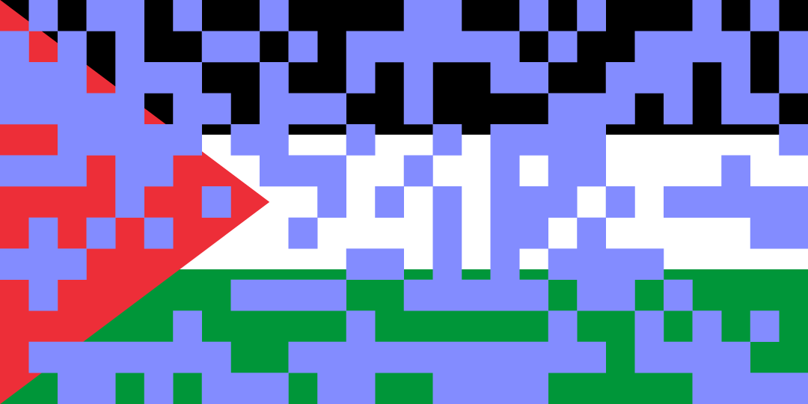
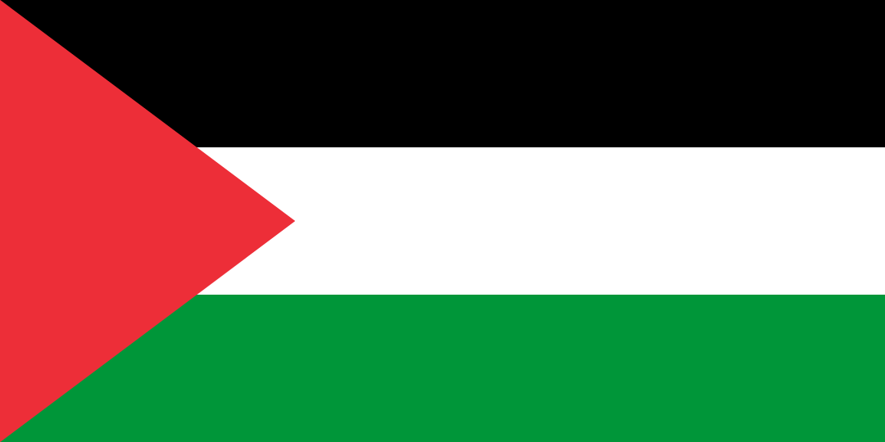

# FlagByte — Pixel Flags as Net Art

One pixel per day for 365 days. The Palestinian flag in slow construction.

## Rules
- **1 Instagram post per day (365 total), scheduled via Meta Business Suite** (official Meta tool).
- Fixed grid & palette defined at the start.
- Consistent output size (1080×1080 or 1080×1350) and sRGB color profile.
- Minimal captions; optional alt text for accessibility.
- No commentary on current events — this is an image–time experiment.

## Repositories
- `flagbyte` — docs & logs
- `flagbyte-instagram-assets` — source files & final exports
- `flagbyte-automation` — scripts

## Structure
- `docs/` — concept, grid specs, palette  
- `logs/` — posting log  
- `references/` — artists, tools

## Posting workflow
1. Prepare batch of exports → `/export/day_XXX.png`.  
2. Use automation scripts to generate captions (`Day X/365. One pixel per day.`).  
3. Upload batch into **Meta Business Suite Planner**.  
4. Schedule posts → 1 per day, covering at least 30 days ahead.  
5. Monitor log updates in `logs/posting-log.md`.

## Previews

Day 001 → Day 183 → Day 365

  
  
  

## Links
- (https://www.instagram.com/flagbyte_palestine/)
