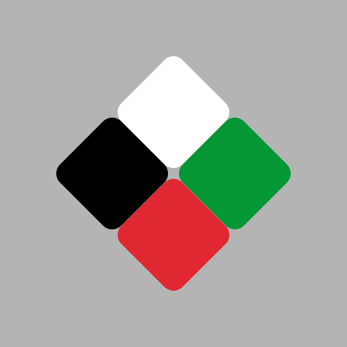

  

# FlagByte — Pixel Flag as Net Art

One pixel per day for 365 days. The Palestinian flag in slow construction. You can check all the progress of this project on: https://www.instagram.com/flagbyte_palestine/

## Concept

FlagByte is a long-form net art experiment: **one pixel per day for 365 days**, slowly constructing the Palestinian flag.

At its core, the project questions the relationship between **image, time, and meaning**.  
The time of art is not the time of reality. Reality is shaped by urgency, acceleration, and the demand for immediacy, while art insists on its own temporality — slower, deliberate, resistant to pressure.  

FlagByte is also an experiment on how the **media system bends our perception of urgency**. News cycles dictate what feels immediate and what is forgotten; events acquire importance or lose it based on how their temporality is framed. By stretching the creation of a single image across an entire year, the project mirrors and critiques this dynamic: the flag emerges not as breaking news, but as a patient accumulation of gestures.

---

## Method

The construction process is a hybrid of **manual design in Illustrator** and **automation**.

### Illustrator workflow
- A square artboard (1080×1080 px) optimized for Instagram.  
- A uniform pixel grid covering the entire artboard.  
- Each square corresponds to one day in the project.  
- The official colors of the Palestinian flag are fixed from day one.  

### Color palette (sRGB)
- Black → `#000000`  
- White → `#FFFFFF`  
- Green → `#007A3D`  
- Red   → `#CE1126`

### Illustrator automation
The daily sequence is generated directly inside Illustrator using a custom `.jsx` script  
(archived in [`scripts/illustrator-export.jsx`](../scripts/illustrator-export.jsx)).

The script takes the prepared pixel grid and progressively **hides one square at a time in random order**.  
After each step, it automatically exports the entire artboard as a 1080px PNG, naming the files in sequence:  
`day_001.png`, `day_002.png`, … up to `day_365.png`.

This process makes the construction both systematic and autonomous:  
- Rules are defined once (grid, palette, export size).  
- The script executes them consistently, day after day.  
- The result is a complete archive of 365 images, ready for Instagram scheduling.

### Posting automation
Once the 365 images are generated, they are not uploaded manually.  
The project relies on **Meta Business Suite** to schedule one post per day, covering an entire year.  

This choice is not only practical but also conceptual:  
- It ensures **consistency and discipline**, with no gaps in the sequence.  
- It underlines that the *act of posting itself becomes automated*, reflecting how social media platforms structure time through feeds, algorithms, and scheduling.  
- The human gesture (building the grid, defining the rules) is combined with a machine-driven rhythm (daily posting without interruption).  

The Instagram posts will also keep the **comments section open**.  
Conversations, reactions, and debates that emerge there are not external to the work: they **become part of the artwork itself**.  
This layer of dialogue will be monitored but not censored, allowing the social response to intertwine with the slow construction of the flag.  
In this sense, the comments form a **parallel archive — unpredictable, collective, and sometimes conflicting — that mirrors how meaning is continuously negotiated in public space**.

---

## Constraints
- Fixed grid and color palette defined on day 1.  
- Output format: 1080×1080 or 1080×1350, sRGB.  
- Minimal captions; optional alt text for accessibility.  
- Posting is automated via Meta Business Suite (1 post/day).  
- Comments remain open and are considered part of the artwork.  

---

## Why
The work investigates how meaning is constructed not in the instant but through repetition and delay.  
The flag becomes not a symbol of urgency but a study in persistence — an image built pixel by pixel, day after day, in tension with the rhythm of media time.

---

## Archive
- Preview images live in this repository.  
- Full source and exports will be archived separately.  
- A public mini-site will mirror progress. 

## Rules
- **1 Instagram post per day (365 total), scheduled via Meta Business Suite** (official Meta tool).
- Fixed grid & palette defined at the start.
- Consistent output size (1080×1080 or 1080×1350) and sRGB color profile.
- Minimal captions; optional alt text for accessibility.
- No commentary on current events — this is an image–time experiment.

## Repositories
- `flagbyte` — docs & logs
- `flagbyte-instagram-assets` — source files & final exports
- `flagbyte-automation` — scripts

## Structure
- `docs/` — concept, grid specs, palette  
- `logs/` — posting log  
- `references/` — artists, tools

## Posting workflow
1. Prepare batch of exports → `/export/day_XXX.png`.  
2. Use automation scripts to generate captions (`Day X/365. One pixel per day.`).  
3. Upload batch into **Meta Business Suite Planner**.  
4. Schedule posts → 1 per day, covering at least 30 days ahead.  
5. Monitor log updates in `logs/posting-log.md`.

## Previews

Day 001 → Day 183 → Day 365

  
  
  

## About

I am Alberto, an independent Italian videomaker in my mid-30s.  
This project is entirely the result of my persistence and of an inexhaustible, restless curiosity about everything that escapes certainty and the definition of reality.  
It is the first experiment of this scale in my life.

If you want to say something about the project or simply say "hi": [flagbyte.palestine@proton.me](mailto:flagbyte.palestine@proton.me)

© 2025 FlagByte Project
